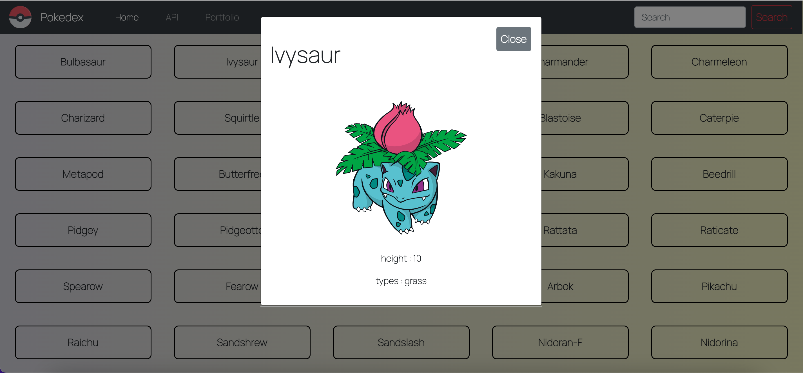

# Pokedex App
a Pokémon database that lets users look up different Pokémon and view their height and types.

<br>

## Objective
The objective was, to build a small web application with HTML, CSS, and JavaScript that loads data from an external API and enables the viewing of data points in detail. It was build as an IIFE(immediately invoced funcion expression) to make only limited amount of functions accessible.

<br>

## Built With
This project was built with HTML, CSS and JavaScript from scratch. 
Towards the end, the frontend appearance was replaced with Bootstrap UI Framework and jQuery Library.

* HTML
* CSS
* JavaScript
* [Bootstrap](https://getbootstrap.com)
* [JQuery](https://jquery.com)
* [External PokeAPI](https://pokeapi.co/)

<br>

## Features

A user can 
- view a collection of Pokémons
- search for a specific Pokémon name
- view a Pokémon's details

<br>

## Getting Started

```bash
git clone https://github.com/LeezaJee/Pokedex.git
cd Pokedex
npm install
```

<br>

## Screenshots





